# `Departments`

### Get all departments

### Get departments by id 

### Set Department

### Update Department

### Delete Department
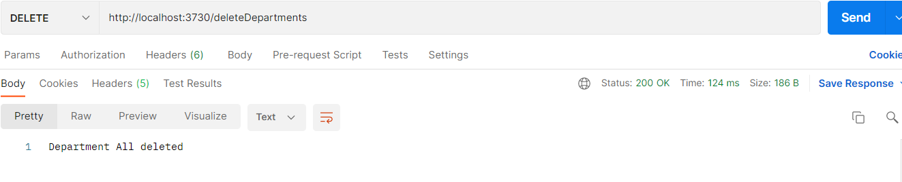

# `Employee`

### Get all employee

### Get employee by id
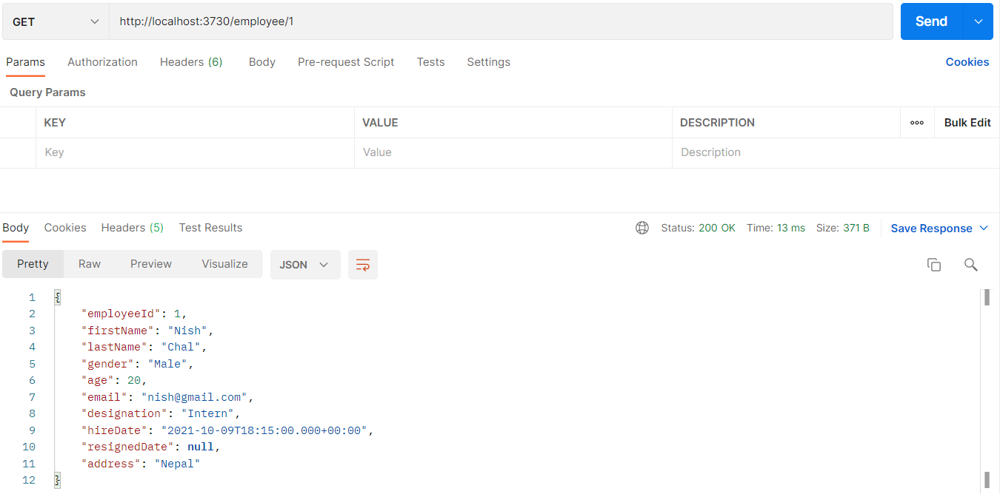
### Find employee by firstName
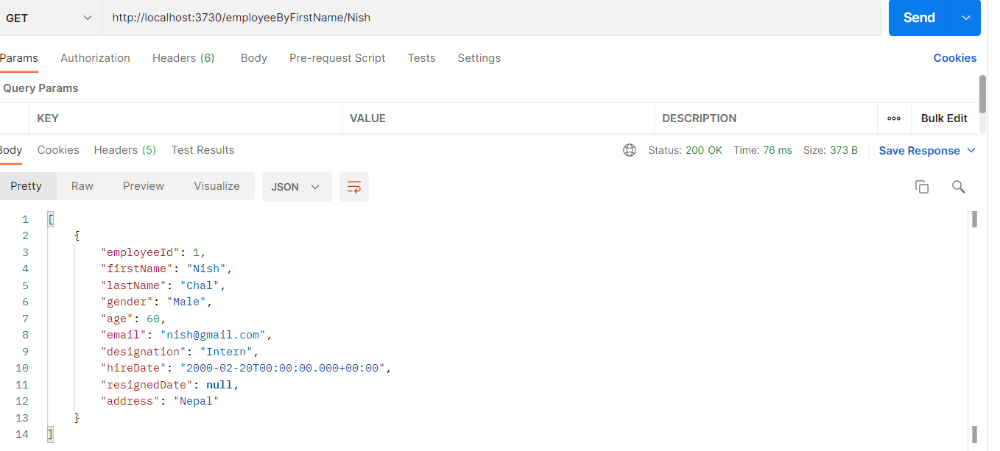
### Find employee by gender and age

### Get employee by gender

### Get employee by named query
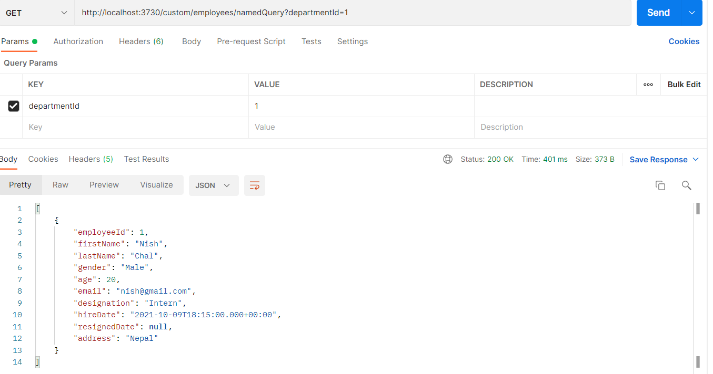
### Get employee Using TypedQuery

### Get employee by Jpql

### Save employee
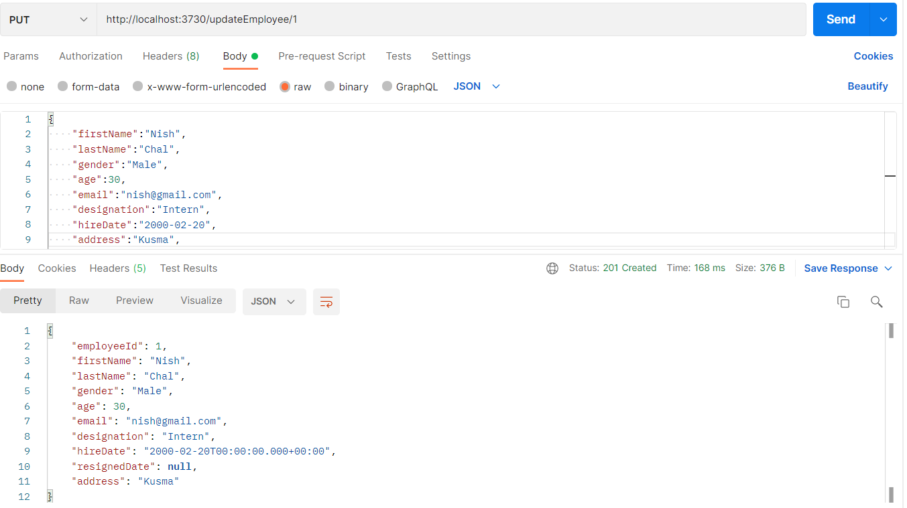
### Update employee

### Update employee age by id

## criteriaApi amount and bound

### delete employee
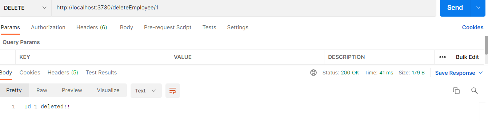

# `Salary`

### Get all Salary

### Get salary by id
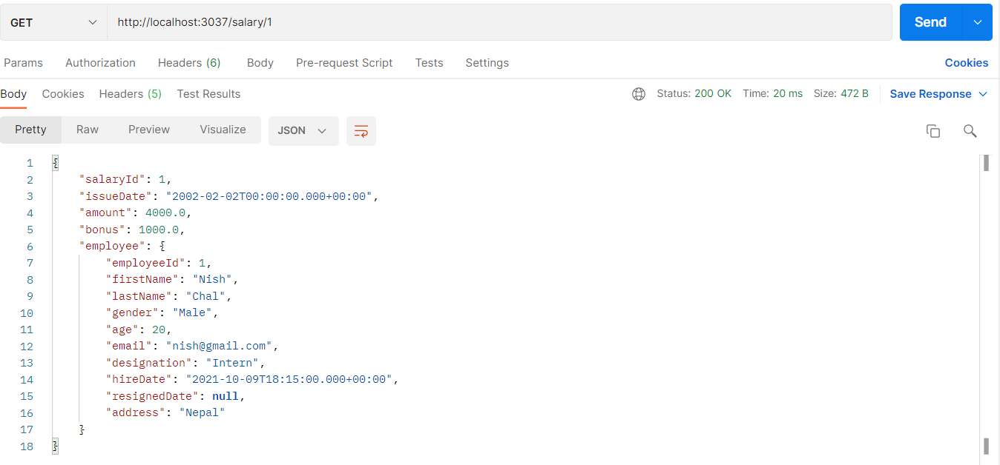
### Save salary

### Update salary

### Delete salary
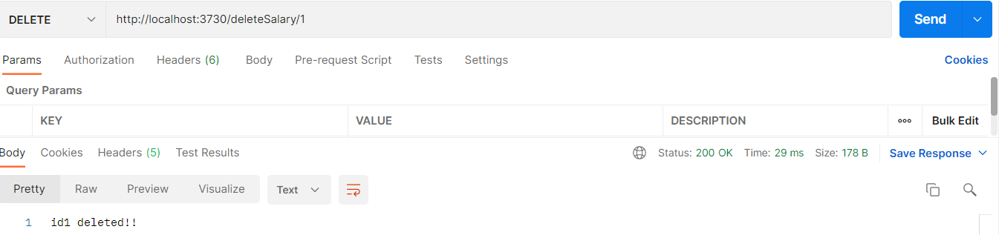

# `Project`

### Get all project
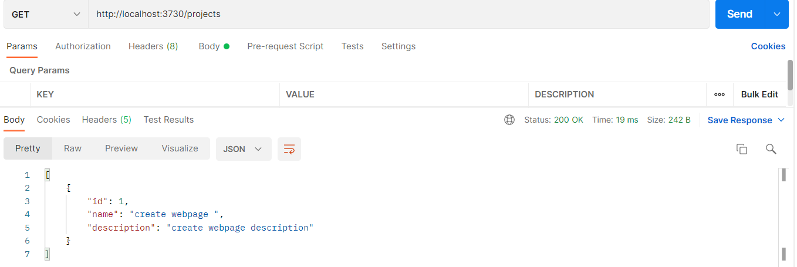
### Get project by id
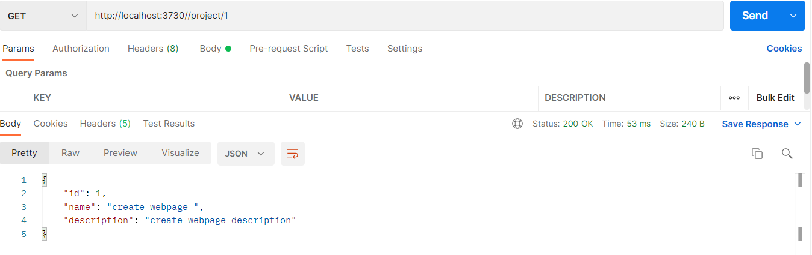
### Save project

### Update project

### Delete project

# `Some Validations`

### Employee name empty

### Project name empty
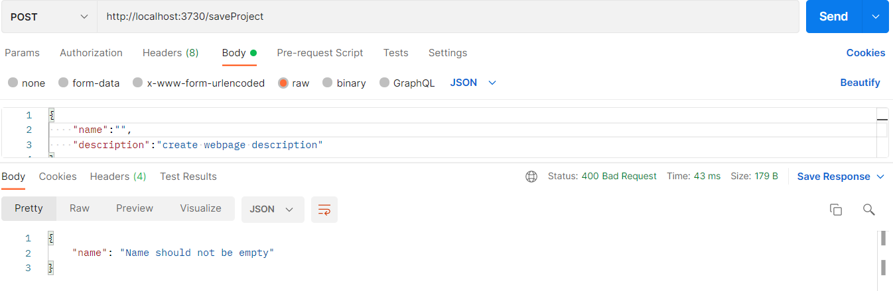